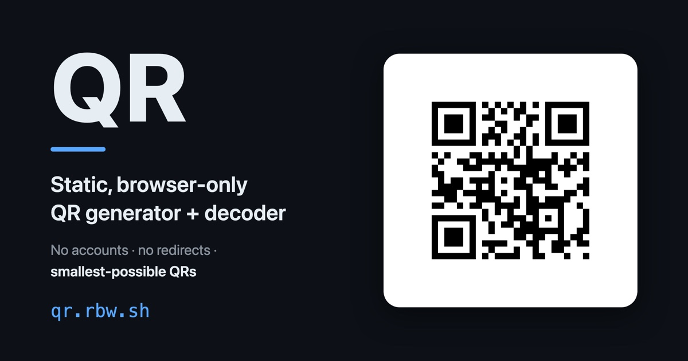

# QR

Static, browser-only QR code generator + decoder. No accounts, no redirects, smallest-possible QRs.

Live at **[qr.rbw.sh]**.



## Features

- **Encode** any text or URL to a QR code, with a live preview that updates as you type.
- **Decode** a QR from an image: drop it, paste it, or click to choose. The decoded text is shown with copy/open actions.
- **Paste anywhere**: paste an image (⌘V / Ctrl+V) to decode it, or paste text outside an input to load it into the encoder.
- **Decode → encode**: a decoded QR seeds the encoder with everything recoverable from the image (text, colors, error-correction level, version, pixel size, quiet-zone margin), so an existing code is one paste away from being customized.
- **Custom styling** over the raw module bitmap (no styling library): independent rounding for the data-module dots and the finder patterns (the big corner anchors), plus dot size and colors.
- **Shareable links**: all encode options live in the URL, so every QR is a link that reproduces it.
- **Dynamic link previews**: sharing a `?t=…` link renders a matching QR as its OpenGraph/Twitter card, via a Cloudflare Pages Function.
- **Smallest-possible QRs**: an uppercase toggle shows when case-folding a case-insensitive URL drops it to a smaller version (alphanumeric mode is denser than byte mode).

## URL parameters

Encoder state is serialized into the query string. Every parameter is optional; the shown value is the default.

| Param | Default | Meaning |
| --- | --- | --- |
| `t` | `https://qr.rbw.sh/` | Text / URL to encode |
| `u` | off | Uppercase the text (present = on) |
| `ecl` | `L` | Error-correction level: `L`, `M`, `Q`, `H` |
| `v` | `0` | QR version 1–40; `0` = smallest that fits |
| `m` | `1` | Quiet-zone margin, in modules |
| `s` | `10` | Pixel size, px per module |
| `fg` | `000000` | Foreground color, hex without `#` |
| `bg` | `ffffff` | Background color, hex without `#` |
| `r` | `0` | Dot corner radius, % of dot size (`50` = circle) |
| `ds` | `100` | Dot size, % of a module |
| `fr` | `0` | Finder corner radius, % of finder size |

Colors are serialized without the leading `#` to avoid `%23` escaping, and decode leniently (with or without `#`, 3- or 6-digit).

## Development

```bash
pnpm install
pnpm dev          # Vite dev server on :3017
```

The QR rendering (`src/lib/render.ts`) is dependency-free and shared between the app and the Pages Function, so the link-preview card matches the on-page QR.

```bash
pnpm build        # type-check + Vite build to dist/
pnpm pages        # wrangler pages dev dist --port 3018 (exercises /og + middleware locally)
pnpm lint
```

## Deploy

Hosted on Cloudflare Pages via two git-connected projects, both building `dist/` from this repo:

| Env  | Project  | Branch | URL                            |
| ---- | -------- | ------ | ------------------------------ |
| prod | `qr`     | `main` | [qr.rbw.sh](https://qr.rbw.sh/)     |
| dev  | `qr-dev` | `dev`  | [dev.qr.rbw.sh](https://dev.qr.rbw.sh/) |

Pushing to a branch triggers that project's build + deploy automatically — `pnpm deploy` (push `main`) and `pnpm deploy:dev` (push current branch to `dev`) are convenience wrappers. The `/og` renderer and OpenGraph `<meta>` rewriting live in `functions/` as Pages Functions.

[qr.rbw.sh]: https://qr.rbw.sh/
